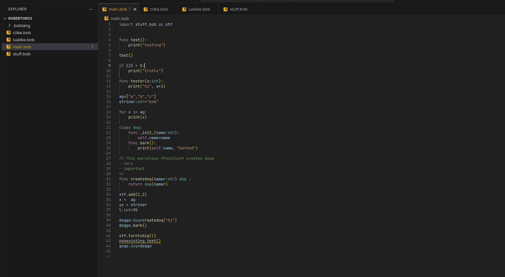
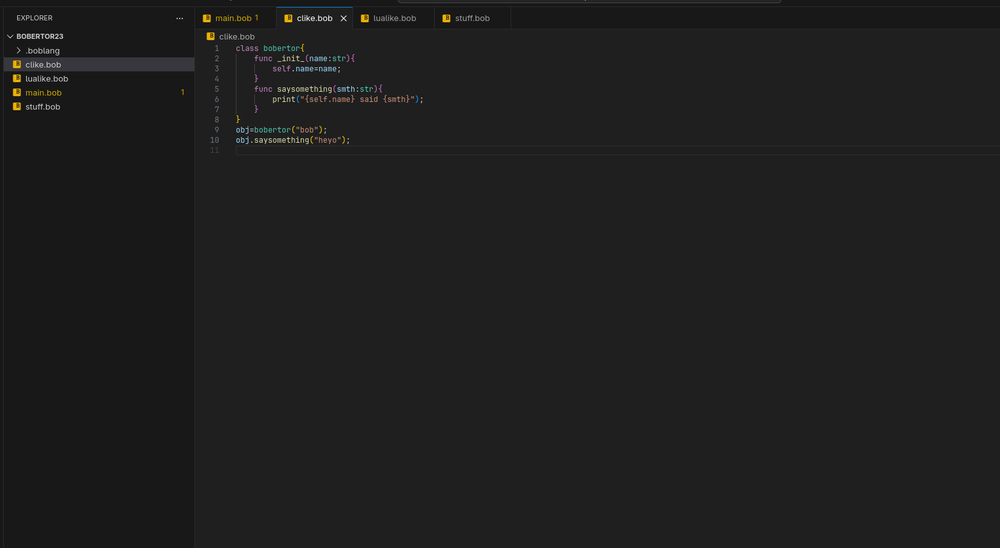
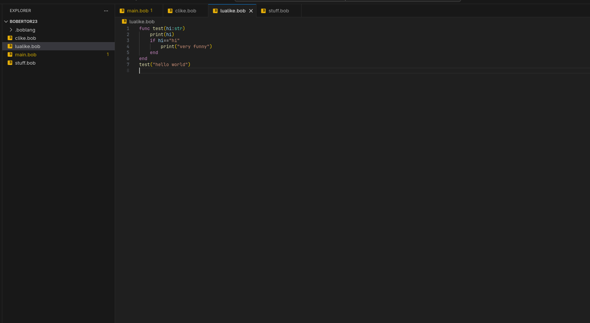

This is syntax highlighting and autocompletion extension for boblang

## Features

Boblang syntax supports many features such as multiple dialect support:
- **Python like**

- **C like**

- **Lua like**

Moreover it has support for:
- Advanced autocomplete

- Undefined variables highlighting

- Module importing autocomplete
